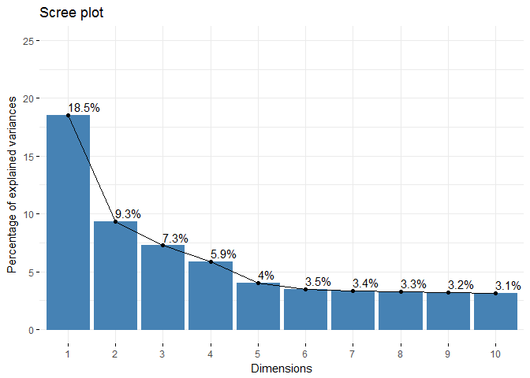
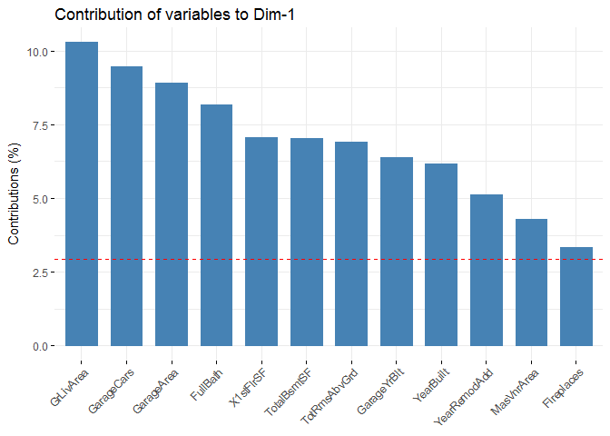
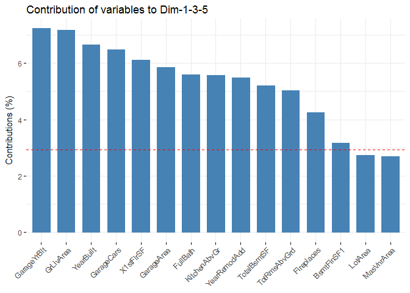
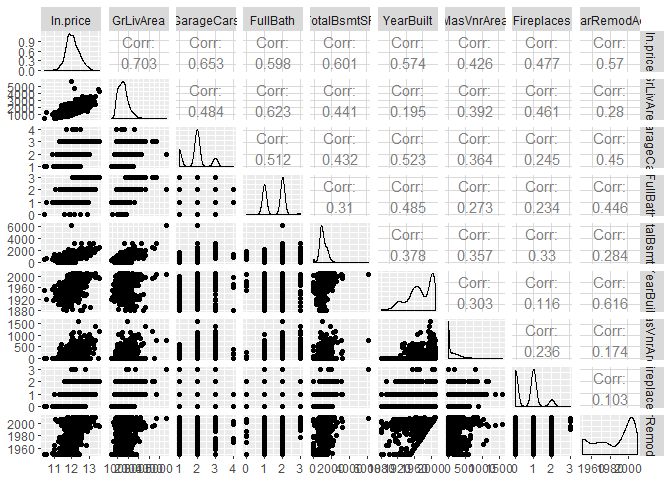

Houseprices - Annexe ACP
================
Gaelle Roger
31 janvier 2018

Cette annexe présente une première analyse très rapide des variables quantitatives du dataset grâce à l'analyse en composantes principales.

``` r
#github_document
```

Chargement des packages
-----------------------

Récupération des données
------------------------

Récupération des datasets de Kaggle :

``` r
train_data <- read.table("train.csv",sep = ",",header = TRUE, na.strings = c("NA", ""))
test_data <- read.table("test.csv",sep = ",",header = TRUE, na.strings = c("NA", ""))
```

Repérage des variables ayant trop de valeurs nulles ou non définies.

``` r
sapply(train_data, function(x) {sum(is.na(x))})
```

    ##            Id    MSSubClass      MSZoning   LotFrontage       LotArea 
    ##             0             0             0           259             0 
    ##        Street         Alley      LotShape   LandContour     Utilities 
    ##             0          1369             0             0             0 
    ##     LotConfig     LandSlope  Neighborhood    Condition1    Condition2 
    ##             0             0             0             0             0 
    ##      BldgType    HouseStyle   OverallQual   OverallCond     YearBuilt 
    ##             0             0             0             0             0 
    ##  YearRemodAdd     RoofStyle      RoofMatl   Exterior1st   Exterior2nd 
    ##             0             0             0             0             0 
    ##    MasVnrType    MasVnrArea     ExterQual     ExterCond    Foundation 
    ##             8             8             0             0             0 
    ##      BsmtQual      BsmtCond  BsmtExposure  BsmtFinType1    BsmtFinSF1 
    ##            37            37            38            37             0 
    ##  BsmtFinType2    BsmtFinSF2     BsmtUnfSF   TotalBsmtSF       Heating 
    ##            38             0             0             0             0 
    ##     HeatingQC    CentralAir    Electrical     X1stFlrSF     X2ndFlrSF 
    ##             0             0             1             0             0 
    ##  LowQualFinSF     GrLivArea  BsmtFullBath  BsmtHalfBath      FullBath 
    ##             0             0             0             0             0 
    ##      HalfBath  BedroomAbvGr  KitchenAbvGr   KitchenQual  TotRmsAbvGrd 
    ##             0             0             0             0             0 
    ##    Functional    Fireplaces   FireplaceQu    GarageType   GarageYrBlt 
    ##             0             0           690            81            81 
    ##  GarageFinish    GarageCars    GarageArea    GarageQual    GarageCond 
    ##            81             0             0            81            81 
    ##    PavedDrive    WoodDeckSF   OpenPorchSF EnclosedPorch    X3SsnPorch 
    ##             0             0             0             0             0 
    ##   ScreenPorch      PoolArea        PoolQC         Fence   MiscFeature 
    ##             0             0          1453          1179          1406 
    ##       MiscVal        MoSold        YrSold      SaleType SaleCondition 
    ##             0             0             0             0             0 
    ##     SalePrice 
    ##             0

On retire du dataset les colonnes où il manque trop de données :

``` r
train_col <- train_data[,-75][,-74][,-73][,-58][,-7][,-4]
```

Déclaration de Overallquality et Overallcondition comme factor et non integer :

``` r
train_col$OverallCond <- as.factor(train_col$OverallCond)
train_col$OverallQual <- as.factor(train_col$OverallQual)
```

On chisit de modéliser le logarithme naturel du prix de vente. Ajout variable ln\_SalePrice, on enleve ensuite la variable Saleprice :

``` r
train_col <- train_col %>%
  mutate(ln.price = log(SalePrice))

train_col <- train_col[,-75]
```

Séparation variables quantitatives et qualitatives :

``` r
ind.quant <- sapply(train_col, function(x) is.numeric(x) | is.integer(x))
ind.qual <- sapply(train_col, function(x) is.factor(x))

# variables quantitatives
data.quant <- train_col[ ,ind.quant]
```

Analyse en composantes Principales sur les variables quantitatives
------------------------------------------------------------------

``` r
sapply(data.quant, function(x) {sum(is.na(x))})
```

    ##            Id    MSSubClass       LotArea     YearBuilt  YearRemodAdd 
    ##             0             0             0             0             0 
    ##    MasVnrArea    BsmtFinSF1    BsmtFinSF2     BsmtUnfSF   TotalBsmtSF 
    ##             8             0             0             0             0 
    ##     X1stFlrSF     X2ndFlrSF  LowQualFinSF     GrLivArea  BsmtFullBath 
    ##             0             0             0             0             0 
    ##  BsmtHalfBath      FullBath      HalfBath  BedroomAbvGr  KitchenAbvGr 
    ##             0             0             0             0             0 
    ##  TotRmsAbvGrd    Fireplaces   GarageYrBlt    GarageCars    GarageArea 
    ##             0             0            81             0             0 
    ##    WoodDeckSF   OpenPorchSF EnclosedPorch    X3SsnPorch   ScreenPorch 
    ##             0             0             0             0             0 
    ##      PoolArea       MiscVal        MoSold        YrSold      ln.price 
    ##             0             0             0             0             0

On enlève les quelques N/A restants :

``` r
data.quant <- data.quant %>%
  filter(!is.na(MasVnrArea)) %>%
  filter(!is.na(GarageYrBlt))
```

Analyse en composantes principales grâce à la fonction PCA du package FactoMineR :

``` r
res.pca <- PCA(data.quant, ncp = 10, quanti.sup = 35, graph = FALSE)
```

Valeurs propres de l'analyse :

``` r
eig.val <- get_eigenvalue(res.pca)
eig.val
```

    ##          eigenvalue variance.percent cumulative.variance.percent
    ## Dim.1  6.292372e+00     1.850698e+01                    18.50698
    ## Dim.2  3.178431e+00     9.348325e+00                    27.85530
    ## Dim.3  2.467752e+00     7.258095e+00                    35.11340
    ## Dim.4  1.997601e+00     5.875296e+00                    40.98869
    ## Dim.5  1.367778e+00     4.022878e+00                    45.01157
    ## Dim.6  1.180489e+00     3.472026e+00                    48.48360
    ## Dim.7  1.144369e+00     3.365792e+00                    51.84939
    ## Dim.8  1.118405e+00     3.289426e+00                    55.13882
    ## Dim.9  1.091785e+00     3.211132e+00                    58.34995
    ## Dim.10 1.061670e+00     3.122558e+00                    61.47251
    ## Dim.11 1.023513e+00     3.010334e+00                    64.48284
    ## Dim.12 1.016538e+00     2.989819e+00                    67.47266
    ## Dim.13 9.924438e-01     2.918952e+00                    70.39161
    ## Dim.14 9.327962e-01     2.743518e+00                    73.13513
    ## Dim.15 9.139329e-01     2.688038e+00                    75.82317
    ## Dim.16 8.724735e-01     2.566099e+00                    78.38927
    ## Dim.17 8.338585e-01     2.452525e+00                    80.84179
    ## Dim.18 8.187686e-01     2.408143e+00                    83.24993
    ## Dim.19 7.720994e-01     2.270881e+00                    85.52081
    ## Dim.20 7.208516e-01     2.120152e+00                    87.64097
    ## Dim.21 6.681407e-01     1.965120e+00                    89.60609
    ## Dim.22 6.145388e-01     1.807467e+00                    91.41355
    ## Dim.23 5.533212e-01     1.627415e+00                    93.04097
    ## Dim.24 4.506927e-01     1.325567e+00                    94.36653
    ## Dim.25 4.237197e-01     1.246234e+00                    95.61277
    ## Dim.26 3.842104e-01     1.130031e+00                    96.74280
    ## Dim.27 2.782552e-01     8.183977e-01                    97.56120
    ## Dim.28 2.304823e-01     6.778890e-01                    98.23909
    ## Dim.29 1.979448e-01     5.821907e-01                    98.82128
    ## Dim.30 1.578468e-01     4.642552e-01                    99.28553
    ## Dim.31 1.258235e-01     3.700691e-01                    99.65560
    ## Dim.32 1.170956e-01     3.443989e-01                   100.00000
    ## Dim.33 4.180191e-30     1.229468e-29                   100.00000
    ## Dim.34 9.592883e-31     2.821436e-30                   100.00000

Graphique des valeurs propres :

``` r
fviz_eig(res.pca, addlabels = TRUE, ylim = c(0, 25))
```



Explication de la variable `ln.price` selon les principales dimensions :

``` r
res.pca$quanti.sup
```

    ## $coord
    ##              Dim.1       Dim.2      Dim.3      Dim.4      Dim.5
    ## ln.price 0.8702046 -0.06755339 0.02383653 0.04611308 -0.1385537
    ##                Dim.6        Dim.7       Dim.8       Dim.9      Dim.10
    ## ln.price -0.02142399 -0.007311102 -0.01080016 -0.01866747 -0.04144832
    ## 
    ## $cor
    ##              Dim.1       Dim.2      Dim.3      Dim.4      Dim.5
    ## ln.price 0.8702046 -0.06755339 0.02383653 0.04611308 -0.1385537
    ##                Dim.6        Dim.7       Dim.8       Dim.9      Dim.10
    ## ln.price -0.02142399 -0.007311102 -0.01080016 -0.01866747 -0.04144832
    ## 
    ## $cos2
    ##             Dim.1      Dim.2        Dim.3       Dim.4      Dim.5
    ## ln.price 0.757256 0.00456346 0.0005681802 0.002126416 0.01919712
    ##                 Dim.6        Dim.7        Dim.8        Dim.9      Dim.10
    ## ln.price 0.0004589874 5.345222e-05 0.0001166435 0.0003484743 0.001717963

Contribution des variables à la dimension principale :

``` r
var <- get_pca_var(res.pca)

# Contributions des variables à PC1
fviz_contrib(res.pca, choice = "var", axes = 1, top = 12)
```



``` r
# Contributions des variables à PC2
#fviz_contrib(res.pca, choice = "var", axes = 2, top = 10)

dim_pca <- c(1,3,5)
fviz_contrib(res.pca, choice = "var", axes = dim_pca, top = 15)
```



### Colinéarité des variables numériques données par ACP

``` r
colineaires <- data.quant %>%
  select(ln.price,GrLivArea,GarageCars,FullBath,TotalBsmtSF,YearBuilt,MasVnrArea,Fireplaces,YearRemodAdd)
ggpairs(colineaires)
```



On remarque que :

GarageArea est lié à GarageCars, X1stFloor est lié TotBsmtSF ToiRmsagrade lié à GrLiveArea GrageYBuilt lié à YearBuilt
