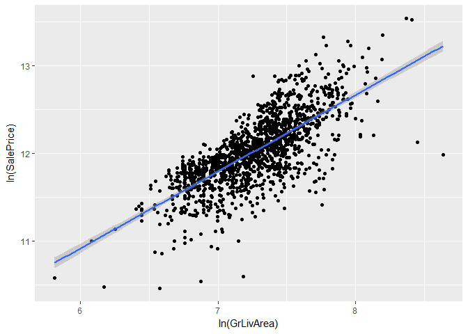
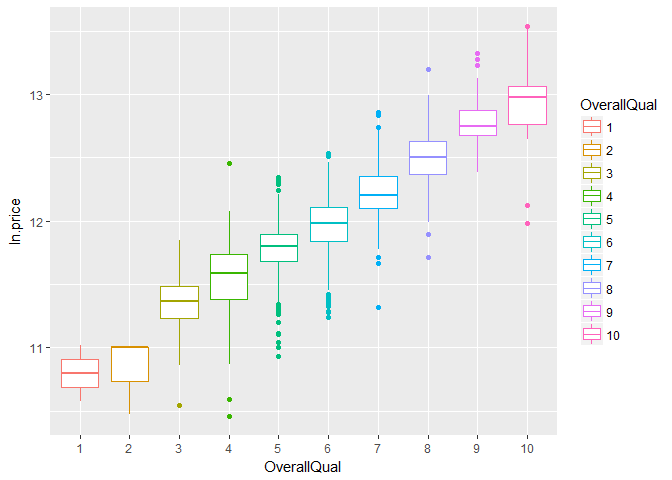
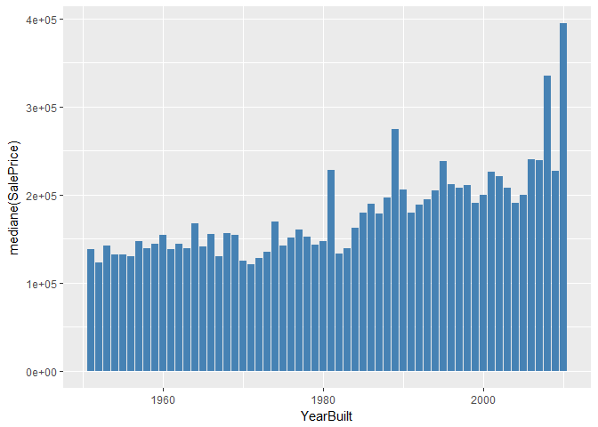
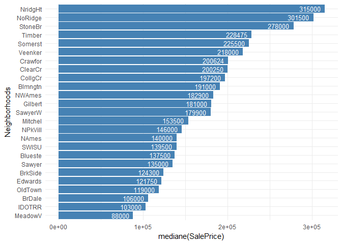
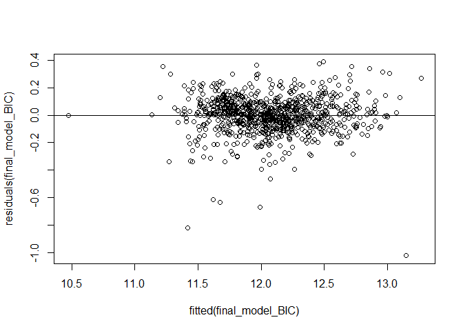
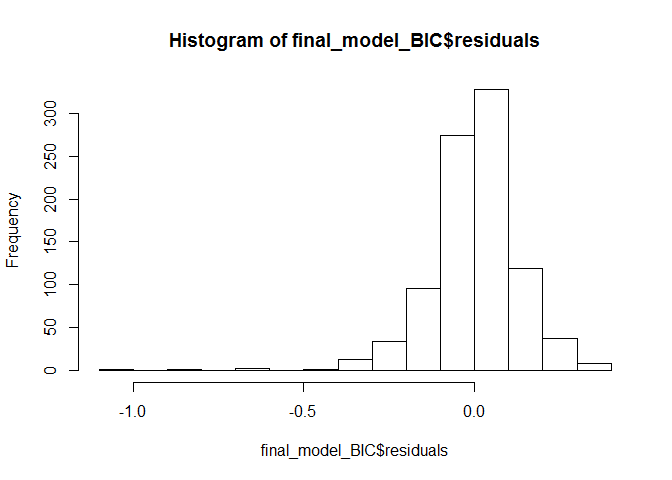

Houseprices
================
Gaelle Roger
31 janvier 2018

``` r
#github_document
```

Chargement des packages
-----------------------

``` r
library(ggplot2)
library(dplyr)
```

    ## 
    ## Attaching package: 'dplyr'

    ## The following objects are masked from 'package:stats':
    ## 
    ##     filter, lag

    ## The following objects are masked from 'package:base':
    ## 
    ##     intersect, setdiff, setequal, union

``` r
library(statsr)
```

Récupération des données
------------------------

Récupération des datasets de Kaggle :

``` r
train_data <- read.table("train.csv",sep = ",",header = TRUE, na.strings = c("NA", ""))
test_data <- read.table("test.csv",sep = ",",header = TRUE, na.strings = c("NA", ""))
```

Analyse rapide des variables :

``` r
#str(train_data)
```

Repérage des variables ayant trop de valeurs nulles ou non définies.

``` r
sapply(train_data, function(x) {sum(is.na(x))})
```

    ##            Id    MSSubClass      MSZoning   LotFrontage       LotArea 
    ##             0             0             0           259             0 
    ##        Street         Alley      LotShape   LandContour     Utilities 
    ##             0          1369             0             0             0 
    ##     LotConfig     LandSlope  Neighborhood    Condition1    Condition2 
    ##             0             0             0             0             0 
    ##      BldgType    HouseStyle   OverallQual   OverallCond     YearBuilt 
    ##             0             0             0             0             0 
    ##  YearRemodAdd     RoofStyle      RoofMatl   Exterior1st   Exterior2nd 
    ##             0             0             0             0             0 
    ##    MasVnrType    MasVnrArea     ExterQual     ExterCond    Foundation 
    ##             8             8             0             0             0 
    ##      BsmtQual      BsmtCond  BsmtExposure  BsmtFinType1    BsmtFinSF1 
    ##            37            37            38            37             0 
    ##  BsmtFinType2    BsmtFinSF2     BsmtUnfSF   TotalBsmtSF       Heating 
    ##            38             0             0             0             0 
    ##     HeatingQC    CentralAir    Electrical     X1stFlrSF     X2ndFlrSF 
    ##             0             0             1             0             0 
    ##  LowQualFinSF     GrLivArea  BsmtFullBath  BsmtHalfBath      FullBath 
    ##             0             0             0             0             0 
    ##      HalfBath  BedroomAbvGr  KitchenAbvGr   KitchenQual  TotRmsAbvGrd 
    ##             0             0             0             0             0 
    ##    Functional    Fireplaces   FireplaceQu    GarageType   GarageYrBlt 
    ##             0             0           690            81            81 
    ##  GarageFinish    GarageCars    GarageArea    GarageQual    GarageCond 
    ##            81             0             0            81            81 
    ##    PavedDrive    WoodDeckSF   OpenPorchSF EnclosedPorch    X3SsnPorch 
    ##             0             0             0             0             0 
    ##   ScreenPorch      PoolArea        PoolQC         Fence   MiscFeature 
    ##             0             0          1453          1179          1406 
    ##       MiscVal        MoSold        YrSold      SaleType SaleCondition 
    ##             0             0             0             0             0 
    ##     SalePrice 
    ##             0

Même analyse pour les jeu de données `test`

``` r
sapply(test_data, function(x) {sum(is.na(x))})
```

    ##            Id    MSSubClass      MSZoning   LotFrontage       LotArea 
    ##             0             0             4           227             0 
    ##        Street         Alley      LotShape   LandContour     Utilities 
    ##             0          1352             0             0             2 
    ##     LotConfig     LandSlope  Neighborhood    Condition1    Condition2 
    ##             0             0             0             0             0 
    ##      BldgType    HouseStyle   OverallQual   OverallCond     YearBuilt 
    ##             0             0             0             0             0 
    ##  YearRemodAdd     RoofStyle      RoofMatl   Exterior1st   Exterior2nd 
    ##             0             0             0             1             1 
    ##    MasVnrType    MasVnrArea     ExterQual     ExterCond    Foundation 
    ##            16            15             0             0             0 
    ##      BsmtQual      BsmtCond  BsmtExposure  BsmtFinType1    BsmtFinSF1 
    ##            44            45            44            42             1 
    ##  BsmtFinType2    BsmtFinSF2     BsmtUnfSF   TotalBsmtSF       Heating 
    ##            42             1             1             1             0 
    ##     HeatingQC    CentralAir    Electrical     X1stFlrSF     X2ndFlrSF 
    ##             0             0             0             0             0 
    ##  LowQualFinSF     GrLivArea  BsmtFullBath  BsmtHalfBath      FullBath 
    ##             0             0             2             2             0 
    ##      HalfBath  BedroomAbvGr  KitchenAbvGr   KitchenQual  TotRmsAbvGrd 
    ##             0             0             0             1             0 
    ##    Functional    Fireplaces   FireplaceQu    GarageType   GarageYrBlt 
    ##             2             0           730            76            78 
    ##  GarageFinish    GarageCars    GarageArea    GarageQual    GarageCond 
    ##            78             1             1            78            78 
    ##    PavedDrive    WoodDeckSF   OpenPorchSF EnclosedPorch    X3SsnPorch 
    ##             0             0             0             0             0 
    ##   ScreenPorch      PoolArea        PoolQC         Fence   MiscFeature 
    ##             0             0          1456          1169          1408 
    ##       MiscVal        MoSold        YrSold      SaleType SaleCondition 
    ##             0             0             0             1             0

On retire des datasets les colonnes où il manque trop de données :

``` r
train_col <- train_data[,-75][,-74][,-73][,-58][,-7][,-4]
test_col <- test_data[,-75][,-74][,-73][,-58][,-7][,-4]
```

Déclaration de Overallquality et condition comme factor et non integer :

``` r
train_col$OverallCond <- as.factor(train_col$OverallCond)
train_col$OverallQual <- as.factor(train_col$OverallQual)

test_col$OverallCond <- as.factor(test_col$OverallCond)
test_col$OverallQual <- as.factor(test_col$OverallQual)
```

Ajout des variables `ln_SalePrice` et `ln_GrLiveArea`. (Des analyses exploratoires ont montré que ces 2 nouvelles variables sont mieux corrélées que les variables initiales. Mais ce n'est pas présenté ici pour des soucis de clarté)

``` r
train_col <- train_col %>%
  mutate(ln.price = log(SalePrice), ln.area = log(GrLivArea))

test_col <- test_col %>%
  mutate(ln.area = log(GrLivArea))

#str(train_col)
```

Partie 1 - Analyse exploratoire des données (EDA)
-------------------------------------------------

Graphes les plus intéressants
-----------------------------

### Corrélation entre le logarithme du prix de vente et le logarithme de la surface habitable.

``` r
ggplot(train_col, aes(x=ln.area, y=ln.price)) + 
  geom_point()+
  geom_smooth(method=lm) +
  xlab("ln(GrLivArea)") +
  ylab("ln(SalePrice)")
```



Coefficient de corrélation de Pearson entre les deux variables :

``` r
cor(train_col$ln.area,train_col$ln.price, method="pearson")
```

    ## [1] 0.7302549

On note une corrélation assez forte entre les deux variables, le prix de vente augmente logiquement lorsque la surface habitable augmente.

### Corrélation entre la qualité globale du bien et le logarithme du prix de vente

``` r
ggplot(train_col, aes(x=OverallQual, y=ln.price, color=OverallQual)) +
  geom_boxplot() 
```



On note encore une forte corrélation entre la condiction gobale et le logarithme du prix de vente. De manière générale, pour un état général donné, le prix de vente n'a pas de valeurs trop dispersées.

### Relation entre le prix de vente et l'année de construction

On réprésente la médiane du prix de vente en fonction de lannée de construction.

``` r
annee_constr <- train_col %>%
  select(SalePrice,YearBuilt) %>%
  filter(YearBuilt>1950) %>%
  group_by(YearBuilt) %>%
  summarise(prix_median = median(SalePrice))

ggplot(annee_constr, aes(x=YearBuilt, y=prix_median)) + 
  geom_bar(stat = "identity", fill="steelblue") +
  ylab("mediane(SalePrice)")
```



D'un point de vue global, on observe une légère augmentation du prix de vente lorsque la maison est plus récente.

### Les prix de vente dans les différents quartiers(Neighborhoods)

Le graphique représente les prix de vente médians les plus élevés selon les quartiers de la ville.

``` r
prix_quartiers <- train_col %>%
  select(Neighborhood, SalePrice) %>%
  group_by(Neighborhood) %>%
  summarise(mediane = median(SalePrice), IQR = IQR(SalePrice))

prix_quartiers
```

    ## # A tibble: 25 x 3
    ##    Neighborhood mediane      IQR
    ##          <fctr>   <dbl>    <dbl>
    ##  1      Blmngtn  191000 39490.00
    ##  2      Blueste  137500 13500.00
    ##  3       BrDale  106000 27000.00
    ##  4      BrkSide  124300 40675.00
    ##  5      ClearCr  200250 58475.00
    ##  6      CollgCr  197200 72766.25
    ##  7      Crawfor  200624 79750.00
    ##  8      Edwards  121750 43725.00
    ##  9      Gilbert  181000 23200.00
    ## 10       IDOTRR  103000 39500.00
    ## # ... with 15 more rows

``` r
ggplot(data = prix_quartiers, aes(x=reorder(Neighborhood, mediane), y=mediane)) +
  geom_bar(stat="identity", fill="steelblue")+
  geom_text(aes(label=mediane), vjust=0.5, hjust = 1.2, size=3.5, color = "white")+
  theme_minimal()+
  coord_flip()+
  ylab("mediane(SalePrice)") +
  xlab("Neighborhoods")
```



Premier modèle, 16 variables
----------------------------

On sépare le dataset d'entrainement en 2 afin de prévenir "l'overfitting".

``` r
train_bis <- train_col

train_test <- train_col %>%
  filter(Id > 1000)

train_col <- train_col %>%
  filter(Id <= 1000)
```

Proposition d'un modèle avec les 16 variables qui nous semblent les plus pertinentes (suite à l'ACP présentée en annexe et à l'analyse exploratoire).

``` r
model16 <- lm(ln.price ~ ln.area + Neighborhood + OverallQual + YearBuilt + GarageCars + FullBath + BsmtQual + KitchenQual + Exterior1st + TotalBsmtSF + CentralAir + MasVnrArea + Fireplaces + SaleCondition + YearRemodAdd + ExterQual, data = na.omit(train_col))

summary(model16)
```

    ## 
    ## Call:
    ## lm(formula = ln.price ~ ln.area + Neighborhood + OverallQual + 
    ##     YearBuilt + GarageCars + FullBath + BsmtQual + KitchenQual + 
    ##     Exterior1st + TotalBsmtSF + CentralAir + MasVnrArea + Fireplaces + 
    ##     SaleCondition + YearRemodAdd + ExterQual, data = na.omit(train_col))
    ## 
    ## Residuals:
    ##      Min       1Q   Median       3Q      Max 
    ## -1.03458 -0.06147  0.00610  0.07083  0.43234 
    ## 
    ## Coefficients:
    ##                        Estimate Std. Error t value Pr(>|t|)    
    ## (Intercept)           4.305e+00  1.096e+00   3.927 9.29e-05 ***
    ## ln.area               3.908e-01  2.485e-02  15.727  < 2e-16 ***
    ## NeighborhoodBlueste  -7.341e-02  1.045e-01  -0.702 0.482592    
    ## NeighborhoodBrDale   -1.068e-01  6.422e-02  -1.662 0.096815 .  
    ## NeighborhoodBrkSide   2.447e-02  5.392e-02   0.454 0.650066    
    ## NeighborhoodClearCr   1.747e-01  5.288e-02   3.304 0.000993 ***
    ## NeighborhoodCollgCr   1.072e-01  4.298e-02   2.495 0.012795 *  
    ## NeighborhoodCrawfor   1.737e-01  5.310e-02   3.271 0.001114 ** 
    ## NeighborhoodEdwards  -3.569e-02  4.969e-02  -0.718 0.472799    
    ## NeighborhoodGilbert   8.276e-02  4.566e-02   1.813 0.070231 .  
    ## NeighborhoodIDOTRR   -8.429e-02  5.764e-02  -1.463 0.143963    
    ## NeighborhoodMeadowV  -1.753e-01  7.418e-02  -2.364 0.018323 *  
    ## NeighborhoodMitchel   6.980e-02  4.958e-02   1.408 0.159558    
    ## NeighborhoodNAmes     5.369e-02  4.680e-02   1.147 0.251617    
    ## NeighborhoodNoRidge   2.325e-01  5.114e-02   4.546 6.27e-06 ***
    ## NeighborhoodNPkVill   1.682e-02  7.227e-02   0.233 0.816011    
    ## NeighborhoodNridgHt   1.489e-01  4.590e-02   3.244 0.001225 ** 
    ## NeighborhoodNWAmes    8.327e-02  4.830e-02   1.724 0.085099 .  
    ## NeighborhoodOldTown  -6.041e-02  5.238e-02  -1.153 0.249131    
    ## NeighborhoodSawyer    5.811e-02  4.890e-02   1.188 0.235029    
    ## NeighborhoodSawyerW   1.028e-01  4.731e-02   2.174 0.029991 *  
    ## NeighborhoodSomerst   1.379e-01  4.463e-02   3.089 0.002073 ** 
    ## NeighborhoodStoneBr   2.180e-01  5.213e-02   4.182 3.19e-05 ***
    ## NeighborhoodSWISU     1.168e-02  6.271e-02   0.186 0.852296    
    ## NeighborhoodTimber    1.317e-01  4.908e-02   2.683 0.007440 ** 
    ## NeighborhoodVeenker   1.893e-01  6.474e-02   2.924 0.003548 ** 
    ## OverallQual3          4.316e-01  1.597e-01   2.702 0.007030 ** 
    ## OverallQual4          3.959e-01  1.454e-01   2.724 0.006591 ** 
    ## OverallQual5          4.411e-01  1.455e-01   3.032 0.002506 ** 
    ## OverallQual6          4.677e-01  1.462e-01   3.200 0.001425 ** 
    ## OverallQual7          5.271e-01  1.471e-01   3.583 0.000359 ***
    ## OverallQual8          6.061e-01  1.483e-01   4.086 4.80e-05 ***
    ## OverallQual9          7.013e-01  1.519e-01   4.618 4.48e-06 ***
    ## OverallQual10         7.148e-01  1.574e-01   4.542 6.37e-06 ***
    ## YearBuilt            -8.153e-05  4.154e-04  -0.196 0.844450    
    ## GarageCars            5.249e-02  1.080e-02   4.862 1.39e-06 ***
    ## FullBath             -8.930e-03  1.345e-02  -0.664 0.506776    
    ## BsmtQualFa           -1.378e-01  4.171e-02  -3.302 0.000998 ***
    ## BsmtQualGd           -4.482e-02  2.233e-02  -2.007 0.045021 *  
    ## BsmtQualTA           -6.248e-02  2.671e-02  -2.340 0.019537 *  
    ## KitchenQualFa        -1.053e-01  4.649e-02  -2.265 0.023739 *  
    ## KitchenQualGd        -4.921e-02  2.325e-02  -2.117 0.034583 *  
    ## KitchenQualTA        -7.837e-02  2.633e-02  -2.976 0.002999 ** 
    ## Exterior1stBrkComm   -5.656e-01  1.427e-01  -3.964 8.00e-05 ***
    ## Exterior1stBrkFace    1.177e-01  5.398e-02   2.180 0.029507 *  
    ## Exterior1stCemntBd    7.281e-02  5.448e-02   1.337 0.181737    
    ## Exterior1stHdBoard    5.756e-02  4.860e-02   1.185 0.236546    
    ## Exterior1stMetalSd    6.600e-02  4.734e-02   1.394 0.163622    
    ## Exterior1stPlywood    6.033e-02  5.044e-02   1.196 0.232059    
    ## Exterior1stStucco     7.497e-02  5.981e-02   1.253 0.210397    
    ## Exterior1stVinylSd    8.018e-02  4.820e-02   1.663 0.096600 .  
    ## Exterior1stWd Sdng    6.389e-02  4.753e-02   1.344 0.179186    
    ## Exterior1stWdShing    6.885e-02  6.006e-02   1.146 0.251979    
    ## TotalBsmtSF           1.258e-04  1.640e-05   7.670 4.72e-14 ***
    ## CentralAirY           1.170e-01  2.458e-02   4.759 2.29e-06 ***
    ## MasVnrArea            8.524e-06  2.984e-05   0.286 0.775188    
    ## Fireplaces            4.296e-02  8.673e-03   4.954 8.79e-07 ***
    ## SaleConditionAdjLand  3.538e-01  1.366e-01   2.590 0.009774 ** 
    ## SaleConditionAlloca  -2.683e-02  6.615e-02  -0.406 0.685090    
    ## SaleConditionFamily  -4.029e-02  4.061e-02  -0.992 0.321367    
    ## SaleConditionNormal   1.004e-01  1.880e-02   5.339 1.20e-07 ***
    ## SaleConditionPartial  1.253e-01  2.573e-02   4.869 1.34e-06 ***
    ## YearRemodAdd          2.066e-03  3.524e-04   5.862 6.53e-09 ***
    ## ExterQualFa          -8.510e-02  8.086e-02  -1.052 0.292921    
    ## ExterQualGd          -2.447e-02  3.318e-02  -0.738 0.461015    
    ## ExterQualTA          -3.329e-03  3.576e-02  -0.093 0.925843    
    ## ---
    ## Signif. codes:  0 '***' 0.001 '**' 0.01 '*' 0.05 '.' 0.1 ' ' 1
    ## 
    ## Residual standard error: 0.1316 on 850 degrees of freedom
    ## Multiple R-squared:  0.891,  Adjusted R-squared:  0.8826 
    ## F-statistic: 106.8 on 65 and 850 DF,  p-value: < 2.2e-16

Sélection du modèle final
-------------------------

Avec comme critère : Bayesian information criterion (BIC)

``` r
library(MASS)
```

    ## 
    ## Attaching package: 'MASS'

    ## The following object is masked from 'package:dplyr':
    ## 
    ##     select

``` r
n <- nrow(na.omit(train_col))

final_model_BIC <- stepAIC(model16, direction = "backward", k=log(n), trace = 0)

summary(final_model_BIC)
```

    ## 
    ## Call:
    ## lm(formula = ln.price ~ ln.area + Neighborhood + OverallQual + 
    ##     GarageCars + TotalBsmtSF + CentralAir + Fireplaces + SaleCondition + 
    ##     YearRemodAdd, data = na.omit(train_col))
    ## 
    ## Residuals:
    ##      Min       1Q   Median       3Q      Max 
    ## -1.02361 -0.06450  0.00631  0.07555  0.38721 
    ## 
    ## Coefficients:
    ##                        Estimate Std. Error t value Pr(>|t|)    
    ## (Intercept)           3.146e+00  6.470e-01   4.862 1.37e-06 ***
    ## ln.area               3.911e-01  2.094e-02  18.680  < 2e-16 ***
    ## NeighborhoodBlueste  -7.212e-02  1.050e-01  -0.687 0.492169    
    ## NeighborhoodBrDale   -1.109e-01  6.207e-02  -1.787 0.074343 .  
    ## NeighborhoodBrkSide   1.806e-02  4.961e-02   0.364 0.715893    
    ## NeighborhoodClearCr   1.758e-01  5.165e-02   3.404 0.000695 ***
    ## NeighborhoodCollgCr   1.118e-01  4.360e-02   2.565 0.010494 *  
    ## NeighborhoodCrawfor   1.792e-01  5.006e-02   3.579 0.000363 ***
    ## NeighborhoodEdwards  -4.302e-02  4.849e-02  -0.887 0.375202    
    ## NeighborhoodGilbert   7.928e-02  4.611e-02   1.720 0.085874 .  
    ## NeighborhoodIDOTRR   -8.027e-02  5.391e-02  -1.489 0.136830    
    ## NeighborhoodMeadowV  -1.523e-01  6.781e-02  -2.247 0.024912 *  
    ## NeighborhoodMitchel   7.474e-02  4.910e-02   1.522 0.128313    
    ## NeighborhoodNAmes     5.606e-02  4.489e-02   1.249 0.212092    
    ## NeighborhoodNoRidge   2.227e-01  5.068e-02   4.394 1.25e-05 ***
    ## NeighborhoodNPkVill   8.679e-03  7.026e-02   0.124 0.901726    
    ## NeighborhoodNridgHt   1.641e-01  4.603e-02   3.564 0.000385 ***
    ## NeighborhoodNWAmes    7.784e-02  4.731e-02   1.645 0.100276    
    ## NeighborhoodOldTown  -7.440e-02  4.682e-02  -1.589 0.112404    
    ## NeighborhoodSawyer    5.078e-02  4.742e-02   1.071 0.284523    
    ## NeighborhoodSawyerW   9.634e-02  4.723e-02   2.040 0.041658 *  
    ## NeighborhoodSomerst   1.357e-01  4.487e-02   3.024 0.002565 ** 
    ## NeighborhoodStoneBr   2.155e-01  5.243e-02   4.111 4.32e-05 ***
    ## NeighborhoodSWISU     2.410e-02  5.989e-02   0.402 0.687517    
    ## NeighborhoodTimber    1.392e-01  4.945e-02   2.815 0.004983 ** 
    ## NeighborhoodVeenker   2.007e-01  6.366e-02   3.153 0.001673 ** 
    ## OverallQual3          4.577e-01  1.549e-01   2.954 0.003222 ** 
    ## OverallQual4          4.216e-01  1.409e-01   2.992 0.002852 ** 
    ## OverallQual5          4.741e-01  1.406e-01   3.371 0.000782 ***
    ## OverallQual6          5.005e-01  1.413e-01   3.541 0.000419 ***
    ## OverallQual7          5.654e-01  1.422e-01   3.976 7.60e-05 ***
    ## OverallQual8          6.579e-01  1.434e-01   4.588 5.13e-06 ***
    ## OverallQual9          8.061e-01  1.458e-01   5.530 4.24e-08 ***
    ## OverallQual10         8.233e-01  1.502e-01   5.482 5.51e-08 ***
    ## GarageCars            5.704e-02  1.068e-02   5.341 1.18e-07 ***
    ## TotalBsmtSF           1.313e-04  1.614e-05   8.135 1.41e-15 ***
    ## CentralAirY           1.281e-01  2.371e-02   5.405 8.36e-08 ***
    ## Fireplaces            4.527e-02  8.637e-03   5.242 2.00e-07 ***
    ## SaleConditionAdjLand  3.882e-01  1.389e-01   2.795 0.005306 ** 
    ## SaleConditionAlloca  -5.024e-02  6.410e-02  -0.784 0.433399    
    ## SaleConditionFamily  -4.355e-02  4.077e-02  -1.068 0.285660    
    ## SaleConditionNormal   1.058e-01  1.887e-02   5.610 2.72e-08 ***
    ## SaleConditionPartial  1.461e-01  2.553e-02   5.723 1.44e-08 ***
    ## YearRemodAdd          2.498e-03  3.152e-04   7.924 6.98e-15 ***
    ## ---
    ## Signif. codes:  0 '***' 0.001 '**' 0.01 '*' 0.05 '.' 0.1 ' ' 1
    ## 
    ## Residual standard error: 0.1344 on 872 degrees of freedom
    ## Multiple R-squared:  0.8833, Adjusted R-squared:  0.8776 
    ## F-statistic: 153.6 on 43 and 872 DF,  p-value: < 2.2e-16

Validation du modèle
--------------------

### Residus

``` r
plot(residuals(final_model_BIC) ~ fitted(final_model_BIC))
abline(h=0)
```



Les résidus sont centrés autour de 0 et ont une variabilité quasi constante.

``` r
hist(final_model_BIC$residuals)
```



De plus, on observe une distribution quasi-normale des résidus autour de zéro.

``` r
#qqnorm(final_model_BIC$residuals)
#qqline(final_model_BIC$residuals)
```

Création de tableaux de données ne contenant que les variables d'intérêt (pour éviter de perdre trop d'infos avec na.omit)

``` r
train_final <- train_col %>%
  dplyr::select(ln.price, ln.area, Neighborhood, OverallQual, GarageCars, TotalBsmtSF, CentralAir, Fireplaces, SaleCondition, YearRemodAdd)

test_final <- test_col %>%
  dplyr::select(Id,ln.area, Neighborhood, OverallQual, GarageCars, TotalBsmtSF, CentralAir, Fireplaces, SaleCondition, YearRemodAdd)
```

### Root-Mean Square Error (RMSE) du modèle

``` r
#install.packages("Metrics")
library(Metrics)

train_omit <- na.omit(train_col)

rmse(exp(final_model_BIC$fitted.values), train_omit$SalePrice)
```

    ## [1] 28028.36

### Overfitting

On applique maitenant le modèle trouvé précédemment sur la deuxième partie du jeu de données d'entrainement afin de vérifier que le modèle reste pertinent.

``` r
test_model_BIC <- lm(formula = ln.price ~ ln.area + Neighborhood + OverallQual + 
    GarageCars + TotalBsmtSF + CentralAir + Fireplaces + SaleCondition + 
    YearRemodAdd, data = na.omit(train_test))

summary(test_model_BIC)
```

    ## 
    ## Call:
    ## lm(formula = ln.price ~ ln.area + Neighborhood + OverallQual + 
    ##     GarageCars + TotalBsmtSF + CentralAir + Fireplaces + SaleCondition + 
    ##     YearRemodAdd, data = na.omit(train_test))
    ## 
    ## Residuals:
    ##      Min       1Q   Median       3Q      Max 
    ## -0.91768 -0.06397  0.00471  0.08116  0.44203 
    ## 
    ## Coefficients:
    ##                        Estimate Std. Error t value Pr(>|t|)    
    ## (Intercept)           5.357e+00  9.508e-01   5.634 3.43e-08 ***
    ## ln.area               2.975e-01  3.198e-02   9.305  < 2e-16 ***
    ## NeighborhoodBrDale   -1.818e-01  9.177e-02  -1.981 0.048303 *  
    ## NeighborhoodBrkSide   4.662e-03  7.609e-02   0.061 0.951183    
    ## NeighborhoodClearCr   3.289e-01  9.432e-02   3.487 0.000546 ***
    ## NeighborhoodCollgCr   1.017e-01  6.298e-02   1.614 0.107299    
    ## NeighborhoodCrawfor   1.987e-01  7.067e-02   2.812 0.005173 ** 
    ## NeighborhoodEdwards  -3.688e-02  6.967e-02  -0.529 0.596820    
    ## NeighborhoodGilbert   3.204e-02  6.641e-02   0.482 0.629743    
    ## NeighborhoodIDOTRR   -1.194e-01  8.780e-02  -1.360 0.174605    
    ## NeighborhoodMeadowV  -1.797e-01  9.283e-02  -1.936 0.053627 .  
    ## NeighborhoodMitchel   1.333e-01  7.541e-02   1.768 0.077837 .  
    ## NeighborhoodNAmes     5.977e-02  6.642e-02   0.900 0.368780    
    ## NeighborhoodNoRidge   2.614e-01  7.365e-02   3.549 0.000435 ***
    ## NeighborhoodNPkVill  -5.917e-02  1.038e-01  -0.570 0.569056    
    ## NeighborhoodNridgHt   1.319e-01  7.153e-02   1.844 0.065952 .  
    ## NeighborhoodNWAmes    5.365e-02  6.700e-02   0.801 0.423775    
    ## NeighborhoodOldTown  -9.433e-02  6.967e-02  -1.354 0.176579    
    ## NeighborhoodSawyer    4.168e-02  7.412e-02   0.562 0.574205    
    ## NeighborhoodSawyerW   9.823e-02  7.237e-02   1.357 0.175475    
    ## NeighborhoodSomerst   4.861e-02  6.706e-02   0.725 0.468967    
    ## NeighborhoodStoneBr   1.850e-01  8.597e-02   2.152 0.032007 *  
    ## NeighborhoodSWISU    -6.989e-02  8.472e-02  -0.825 0.409959    
    ## NeighborhoodTimber    1.208e-01  7.429e-02   1.627 0.104624    
    ## NeighborhoodVeenker   3.040e-01  1.026e-01   2.963 0.003236 ** 
    ## OverallQual3         -2.121e-01  1.770e-01  -1.198 0.231686    
    ## OverallQual4          3.033e-02  1.628e-01   0.186 0.852300    
    ## OverallQual5          1.186e-01  1.625e-01   0.730 0.466136    
    ## OverallQual6          1.928e-01  1.628e-01   1.185 0.236852    
    ## OverallQual7          2.661e-01  1.655e-01   1.608 0.108562    
    ## OverallQual8          3.868e-01  1.680e-01   2.302 0.021852 *  
    ## OverallQual9          6.131e-01  1.756e-01   3.491 0.000537 ***
    ## OverallQual10         5.351e-01  1.886e-01   2.837 0.004798 ** 
    ## GarageCars            8.891e-02  1.514e-02   5.871 9.43e-09 ***
    ## TotalBsmtSF           3.183e-06  2.229e-05   0.143 0.886490    
    ## CentralAirY           1.774e-01  4.238e-02   4.186 3.53e-05 ***
    ## Fireplaces            4.368e-02  1.407e-02   3.104 0.002054 ** 
    ## SaleConditionAlloca   1.739e-01  1.082e-01   1.606 0.108998    
    ## SaleConditionFamily   1.032e-01  6.647e-02   1.553 0.121344    
    ## SaleConditionNormal   1.972e-02  2.940e-02   0.671 0.502652    
    ## SaleConditionPartial  6.093e-02  4.087e-02   1.491 0.136848    
    ## YearRemodAdd          1.947e-03  4.677e-04   4.162 3.90e-05 ***
    ## ---
    ## Signif. codes:  0 '***' 0.001 '**' 0.01 '*' 0.05 '.' 0.1 ' ' 1
    ## 
    ## Residual standard error: 0.142 on 380 degrees of freedom
    ## Multiple R-squared:   0.86,  Adjusted R-squared:  0.8449 
    ## F-statistic: 56.93 on 41 and 380 DF,  p-value: < 2.2e-16

Les coefficients de regression sont légèrement inférieurs à ceux obtenus avec le premier jeu de données mais sont encore tout à fait acceptables. A priori, il n'y a pas de problème d'overfitting.

### Modele et prédiction finale

Ré-apprentissage du modèle sur l'ensemble des données d'entrainement fournies par Kaggle.

``` r
final_model <- lm(ln.price ~ ln.area + Neighborhood + OverallQual + 
    GarageCars + TotalBsmtSF + CentralAir + Fireplaces + SaleCondition + 
    YearRemodAdd, data = na.omit(train_final))

summary(final_model)
```

    ## 
    ## Call:
    ## lm(formula = ln.price ~ ln.area + Neighborhood + OverallQual + 
    ##     GarageCars + TotalBsmtSF + CentralAir + Fireplaces + SaleCondition + 
    ##     YearRemodAdd, data = na.omit(train_final))
    ## 
    ## Residuals:
    ##      Min       1Q   Median       3Q      Max 
    ## -1.04739 -0.06625  0.00795  0.07591  0.48459 
    ## 
    ## Coefficients:
    ##                        Estimate Std. Error t value Pr(>|t|)    
    ## (Intercept)           3.363e+00  6.028e-01   5.578 3.17e-08 ***
    ## ln.area               3.877e-01  1.981e-02  19.576  < 2e-16 ***
    ## NeighborhoodBlueste  -6.481e-02  1.079e-01  -0.601 0.548196    
    ## NeighborhoodBrDale   -1.029e-01  6.351e-02  -1.620 0.105558    
    ## NeighborhoodBrkSide   9.589e-03  4.981e-02   0.192 0.847396    
    ## NeighborhoodClearCr   1.738e-01  5.268e-02   3.298 0.001008 ** 
    ## NeighborhoodCollgCr   1.120e-01  4.479e-02   2.502 0.012527 *  
    ## NeighborhoodCrawfor   1.705e-01  5.100e-02   3.344 0.000858 ***
    ## NeighborhoodEdwards  -2.538e-02  4.842e-02  -0.524 0.600251    
    ## NeighborhoodGilbert   8.513e-02  4.723e-02   1.802 0.071788 .  
    ## NeighborhoodIDOTRR   -1.126e-01  5.299e-02  -2.125 0.033803 *  
    ## NeighborhoodMeadowV  -1.155e-01  6.351e-02  -1.818 0.069335 .  
    ## NeighborhoodMitchel   7.177e-02  4.999e-02   1.436 0.151370    
    ## NeighborhoodNAmes     6.254e-02  4.590e-02   1.363 0.173354    
    ## NeighborhoodNoRidge   2.243e-01  5.195e-02   4.318 1.74e-05 ***
    ## NeighborhoodNPkVill   1.462e-02  7.219e-02   0.203 0.839566    
    ## NeighborhoodNridgHt   1.612e-01  4.726e-02   3.411 0.000675 ***
    ## NeighborhoodNWAmes    8.014e-02  4.853e-02   1.651 0.099012 .  
    ## NeighborhoodOldTown  -7.448e-02  4.733e-02  -1.574 0.115927    
    ## NeighborhoodSawyer    4.861e-02  4.845e-02   1.003 0.315950    
    ## NeighborhoodSawyerW   8.978e-02  4.805e-02   1.868 0.062017 .  
    ## NeighborhoodSomerst   1.368e-01  4.592e-02   2.978 0.002976 ** 
    ## NeighborhoodStoneBr   2.160e-01  5.394e-02   4.004 6.70e-05 ***
    ## NeighborhoodSWISU     3.117e-02  5.940e-02   0.525 0.599898    
    ## NeighborhoodTimber    1.409e-01  5.084e-02   2.772 0.005681 ** 
    ## NeighborhoodVeenker   2.017e-01  6.548e-02   3.080 0.002132 ** 
    ## OverallQual2         -6.279e-02  1.398e-01  -0.449 0.653367    
    ## OverallQual3          1.118e-01  1.085e-01   1.030 0.303096    
    ## OverallQual4          2.702e-01  1.024e-01   2.640 0.008435 ** 
    ## OverallQual5          3.207e-01  1.022e-01   3.137 0.001757 ** 
    ## OverallQual6          3.460e-01  1.030e-01   3.359 0.000814 ***
    ## OverallQual7          4.149e-01  1.043e-01   3.977 7.52e-05 ***
    ## OverallQual8          5.049e-01  1.062e-01   4.755 2.29e-06 ***
    ## OverallQual9          6.543e-01  1.096e-01   5.967 3.40e-09 ***
    ## OverallQual10         6.692e-01  1.155e-01   5.796 9.21e-09 ***
    ## GarageCars            5.596e-02  8.688e-03   6.441 1.88e-10 ***
    ## TotalBsmtSF           1.400e-04  1.399e-05  10.009  < 2e-16 ***
    ## CentralAirY           1.074e-01  2.095e-02   5.126 3.58e-07 ***
    ## Fireplaces            4.552e-02  8.546e-03   5.327 1.24e-07 ***
    ## SaleConditionAdjLand  1.254e-01  7.417e-02   1.691 0.091218 .  
    ## SaleConditionAlloca  -2.104e-03  4.852e-02  -0.043 0.965425    
    ## SaleConditionFamily  -3.726e-02  4.134e-02  -0.901 0.367629    
    ## SaleConditionNormal   1.140e-01  1.805e-02   6.312 4.21e-10 ***
    ## SaleConditionPartial  1.514e-01  2.497e-02   6.064 1.91e-09 ***
    ## YearRemodAdd          2.480e-03  2.987e-04   8.302 3.47e-16 ***
    ## ---
    ## Signif. codes:  0 '***' 0.001 '**' 0.01 '*' 0.05 '.' 0.1 ' ' 1
    ## 
    ## Residual standard error: 0.1384 on 955 degrees of freedom
    ## Multiple R-squared:  0.8888, Adjusted R-squared:  0.8837 
    ## F-statistic: 173.5 on 44 and 955 DF,  p-value: < 2.2e-16

### Remplacement des données manquantes dans les données de test

Il y a 1 NA pour Garage Cars et 1 pour TotalBsmtSF. On remplace les NA par la médiane de chaque variable :

``` r
summary(test_final$GarageCars)
```

    ##    Min. 1st Qu.  Median    Mean 3rd Qu.    Max.    NA's 
    ##   0.000   1.000   2.000   1.766   2.000   5.000       1

``` r
summary(test_final$TotalBsmtSF)
```

    ##    Min. 1st Qu.  Median    Mean 3rd Qu.    Max.    NA's 
    ##       0     784     988    1046    1305    5095       1

``` r
test_final$GarageCars[is.na(test_final$GarageCars)]<-2
test_final$TotalBsmtSF[is.na(test_final$TotalBsmtSF)]<-988
```

### Prédiction de prix de vente pour chaque maison contenue dans le fichier test :

On applique le modèle final sur les données de test.

``` r
previsions_brutes <- predict(final_model, test_final, type = "response")

test_final <- test_final %>%
  mutate(ln.price = previsions_brutes, SalePrice = exp(previsions_brutes))
```

### Création fichier soumission

``` r
submission <- data.frame(Id = test_final$Id, SalePrice = test_final$SalePrice)
write.csv(submission, file = "submission.csv", row.names = FALSE)
```

Résultat Kaggle : Your submission scored 0.14925 (Root Mean Squared Logarithmic Error)
--------------------------------------------------------------------------------------
